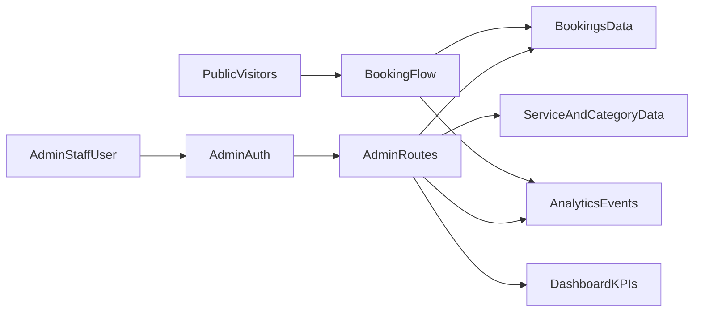

# Admin UI Implementation Plan

## Objective
Build a private admin insights and operations UI (issue `#12`) so staff can monitor:
- all bookings for the day
- most-booked service/session categories
- website traffic-to-booking behavior and conversion

This plan assumes **admin-only access** (no public customer login portal in this phase).

## Scope

### In scope
- Admin dashboard and supporting admin pages for booking operations + demand insights.
- Daily booking board and status pipeline.
- Demand metrics for top services/categories across day/week/month.
- Website behavior metrics that matter for operations conversion.
- Supabase-backed data access with admin-only route protection.

### Out of scope
- Public customer account portal.
- Full external BI stack.
- Marketing automation flows.

## Target routes
- `/admin/dashboard` - Executive/operations overview.
- `/admin/bookings` - Daily list + filters + status workflow.
- `/admin/services` - Service catalog management and demand summaries.
- `/admin/service-categories` - Category management + demand ranking.
- `/admin/clients` - New vs returning client snapshots and booking history.
- `/admin/insights` (optional in phase 2) - deeper traffic/funnel analysis.

## Data and KPI model

### Booking KPIs (required)
- `bookings_today_count`
- `pending_confirmations_count`
- `in_progress_count`
- `completed_today_count`
- `cancelled_today_count`
- `seven_day_upcoming_count`

### Demand KPIs (required)
- `top_service_type_by_bookings`
- `top_category_by_bookings`
- `service_type_bookings_time_series` (day/week/month)
- `category_bookings_time_series` (day/week/month)

### Website behavior KPIs (required)
- `visitor_sessions_total`
- `booking_form_starts`
- `booking_submissions`
- `booking_conversion_rate`
- `top_entry_pages_for_converted_bookings`

### Recommended operational KPIs
- confirmation response backlog age
- repeat vs new clients ratio
- no-show/cancellation trend

## Data sources and wiring
- **Supabase tables**: `bookings`, `service_types`, `profiles` (for admin/staff), and related audit/history tables when available.
- **Analytics source**: existing site analytics/event stream (e.g., Vercel Analytics + explicit booking events) surfaced into admin summaries.
- **Route security**:
  - Middleware + server checks for `/admin/*`
  - enforce `profiles.role in ('admin', 'staff')`
  - deny non-admin users at both UI and data-policy layers

## UI composition

### `/admin/dashboard`
- KPI cards row (today bookings, pending confirmations, in progress, conversion rate).
- Booking pipeline list (new -> confirmed -> in progress -> completed/cancelled).
- Top booked services/categories panel.
- 7-day schedule panel.
- traffic-to-booking mini funnel.

### `/admin/bookings`
- table with filters: date, status, service/category, urgency.
- quick actions: confirm, reschedule, mark in progress, complete, cancel.
- backlog view for unconfirmed/new requests.

### `/admin/services` + `/admin/service-categories`
- CRUD views.
- usage counters and trend chips.
- active/inactive state controls.

### `/admin/clients`
- recent clients list.
- repeat vs new client badges.
- client booking history summary.

## Event instrumentation checklist
- track booking form start.
- track booking submit success/failure.
- track source page/route for submission.
- normalize service/category identifier in booking payload (single canonical value).

## Phased rollout

### Phase 1 - secure admin baseline
1. finalize route guard behavior for `/admin/*`.
2. wire admin pages to real booking/service/category data.
3. ship daily bookings board and KPI cards.

### Phase 2 - demand insights
1. add top-booked service/category views with time range filters.
2. add trends for cancellations/no-shows and repeat clients.

### Phase 3 - traffic and conversion insight
1. expose visitor, form-start, submission, conversion KPIs in admin.
2. add top-converting entry pages report.
3. add optional `/admin/insights` deep-dive page if needed.

## Acceptance criteria
- Admin can open dashboard and see accurate booking counts for the current day.
- Admin can identify most-booked service and category for selected period.
- Admin can see traffic-to-booking conversion metrics in the admin UI.
- Admin can manage bookings/services/categories/clients from private routes only.
- Non-admin users cannot access `/admin/*` data or pages.
- Public staff entry link `/admin-login` remains accessible and can route authorized users into `/admin`.

## Implementation checklist
- [x] confirm schema coverage for booking + service + category metrics
- [x] define query layer/services for dashboard metrics
- [x] implement dashboard KPI cards and trend components
- [x] implement booking board filters + status actions
- [x] implement demand ranking panels (services/categories)
- [x] implement conversion metrics panel
- [x] enforce middleware/server/admin role guard checks
- [x] QA with realistic fixture data and edge cases

## Post-QA fixes
- [x] Fixed admin route matcher to avoid treating `/admin-login` as a protected `/admin/*` route.
- [x] Added public admin entry page and footer link so staff can reliably find admin access.
- [x] Added temporary demo login flow (`/admin-login`) with session cookie bypass for admin preview access.

## Architecture flow

