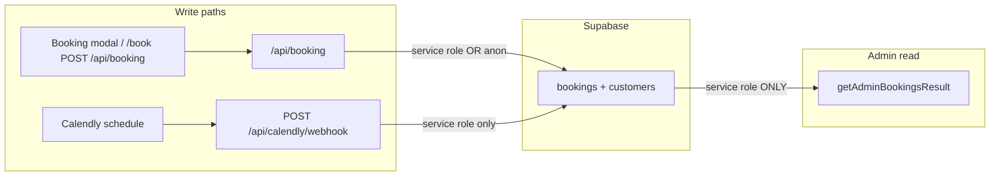

# Admin booking data — why rows may not appear

**Overview:** Booking data reaches the admin portal only by reading the Supabase `bookings` table (with `customers`) via the service-role client in live mode—or by showing the mock layer when env flags say so. Writes can succeed via the public booking API using the anon key even when the admin read path cannot, and Calendly-driven bookings depend entirely on the webhook plus service role.

## How the admin list gets its rows

The bookings UI ([`app/admin/bookings/page.tsx`](app/admin/bookings/page.tsx)) calls `getAdminBookingsResult()` from [`lib/admin/queries.ts`](lib/admin/queries.ts). That function:

1. **If mock mode** — Returns data from [`lib/admin/mock-repository.ts`](lib/admin/mock-repository.ts) and sets `diagnostics.dataSource` to `'mock'`. Real Supabase rows are never shown. The page shows an amber **“Mock mode enabled”** banner when `diagnostics.dataSource === 'mock'`.

2. **If live mode** — Uses **only** [`getServiceRoleClient()`](lib/supabase/service-role.ts), which requires both `NEXT_PUBLIC_SUPABASE_URL` and `SUPABASE_SERVICE_ROLE_KEY`. There is **no** anon-key fallback for admin reads.

3. **Query** — Selects from `bookings` with an embedded `customers(...)` relation, newest first, capped at **200** rows in memory (`getAdminBookingsResult` uses `.slice(0, 200)` on the result).

The header line **“Data source: … (connected / issue detected)”** and any red **“Admin bookings data is unavailable”** box come straight from `diagnostics` (`queryOk`, `errorCode`, `errorMessage`). That is the fastest way to see *which* branch you are in without opening Supabase.

## Root causes (most actionable first)

### 1. Mock mode is on

[`lib/admin/data-source.ts`](lib/admin/data-source.ts): mock is enabled if `ADMIN_DATA_SOURCE=mock` OR `NEXT_PUBLIC_ADMIN_MOCK=1`.

You will see demo bookings and the mock banner; **production submissions will not appear**. Fix: unset those for the environment where you expect live data.

### 2. Service role missing for admin, but bookings still insert via anon (classic “data exists but admin is empty”)

[`app/api/booking/route.ts`](app/api/booking/route.ts) builds the DB client as:

`getServiceRoleClient() ?? createClient(anonUrl, anonKey)` — so the public API can write using the **anon** key if the service role is absent.

`getAdminBookingsResult` returns **zero rows** and `errorCode: 'SERVICE_ROLE_MISSING'` when `getServiceRoleClient()` is null.

**Symptom:** Bookings succeed from the site (or appear in Supabase Table Editor), but `/admin/bookings` shows **issue detected** + empty list. **Fix:** Set `SUPABASE_SERVICE_ROLE_KEY` on the **same** deployment (e.g. Vercel) as the app; never expose it to the client.

### 3. Calendly is the booking path: webhook never creates rows

When [`getCalendlyConfig()`](lib/calendly.ts) is non-null and `NEXT_PUBLIC_CALENDLY_USE_POPUP_FLOW` is enabled, [`SiteChrome`](components/SiteChrome.tsx) sends users through the Calendly prequalify + popup flow instead of the modal. Completed schedules are **not** sent to `/api/booking`; they only hit your DB if Calendly’s **webhook** calls [`app/api/calendly/webhook/route.ts`](app/api/calendly/webhook/route.ts).

That route **requires** `getServiceRoleClient()`; if unavailable it returns **503** and inserts nothing. Even with service role, the subscription must point to your deployed URL, subscribe to `invitee.created` / `invitee.canceled`, and if you use `CALENDLY_WEBHOOK_TOKEN`, the request must include the matching `?token=` query param.

### 4. Query error (not mock, service role present)

If the `bookings` select fails, you get `queryOk: false` and an error code/message (e.g. missing table, RLS misconfiguration on a non–service-role path — though service role bypasses RLS). The code also handles **schema drift** (`service_type_id` missing) with a fallback select and a **schema compatibility** amber notice — that path still returns rows if data exists.

### 5. UI filters, not “missing data”

[`filterBookings`](app/admin/bookings/page.tsx) applies **Today**, status tabs, search, and date range. Wrong tab or date range yields **“No bookings match”** while `diagnostics` can still show **connected** and a non-zero total before filtering — check the “Showing X–Y of Z” line and try **All** with cleared dates/search.

### 6. Wrong Supabase project or environment

Local `.env` vs Vercel env: if `NEXT_PUBLIC_SUPABASE_URL` points at project A while you inspect project B in the dashboard, the admin will look empty. Align URL and keys per environment.

---

## Verification checklist

| Check | Where |
| --- | --- |
| Mock vs live | `/admin/bookings` header + banners; env: `ADMIN_DATA_SOURCE`, `NEXT_PUBLIC_ADMIN_MOCK` |
| Service role | Env: `SUPABASE_SERVICE_ROLE_KEY` set on server; diagnostics should not show `SERVICE_ROLE_MISSING` |
| Rows in DB | Supabase Table Editor: `bookings` + `customers` |
| Form path | Server logs / Network: `POST /api/booking` returns 200 with `booking_id` |
| Calendly path | `NEXT_PUBLIC_CALENDLY_EVENT_URL` + popup flag; Calendly webhook delivery logs; `POST /api/calendly/webhook` 200 vs 401/503 |
| Filters | Query params `status`, `from`, `to`, `q` on `/admin/bookings` |

This covers the full pipeline: **env-driven read path**, **asymmetric write path (anon vs service role)**, and **Calendly-only ingestion via webhook**.

## Action items

- [ ] On `/admin/bookings`, read Data source line + any error banner (mock vs `SERVICE_ROLE_MISSING` vs query error)
- [ ] Confirm deployment env: no mock flags; `SUPABASE_SERVICE_ROLE_KEY` set; URL matches Supabase project being inspected
- [ ] If using Calendly popup: webhook URL, events, token, and 503/401 logs; if using form: compare Table Editor rows with admin list
- [ ] Reset to `status=all` and clear search/date filters to rule out UI filtering
