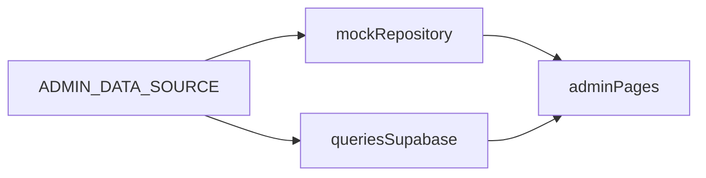

# Admin portal upgrade

Single checklist for **design acceptance** (mock-first) and **production readiness** (CRM completeness) for the local-plumbing admin experience. This document **extends** [adminUI-implementationplan.md](./adminUI-implementationplan.md); it does not replace the original scope—it adds mock-first design lock, niche analytics, and operational gaps.

**Implementation status (baseline shipped):** Phases A–E are **largely complete** in code (`lib/admin/mock-repository.ts`, `lib/admin/queries.ts`, `components/admin/AdminShell.tsx`, bookings/clients/dashboard/insights, etc.). The checklist below uses **`[x]`** for delivered items and **`[ ]`** for optional polish or **follow-up** work (scale, persisted settings, extra analytics). See **§8 Remaining follow-up** for the backlog that was identified after the first pass.

---

## 1. Purpose

| Goal | Notes |
|------|--------|
| **Design acceptance** | Stakeholders can review UI/UX with predictable, demo-rich data before touching production. |
| **Production readiness** | Bookings, clients, insights, and settings behave as a coherent CRM for dispatch and ownership. |
| **Niche fit** | KPIs and workflows reflect emergency vs scheduled work, SLA-style backlogs, and plumbing-specific service mix—not generic “conversion %” only. |

---

## 2. Mock vs live

| Item | Checklist |
|------|-----------|
| **Env switch** | `[x]` `ADMIN_DATA_SOURCE=mock` or `NEXT_PUBLIC_ADMIN_MOCK=1` selects data source ([lib/admin/data-source.ts](lib/admin/data-source.ts)). |
| **Single mock layer** | `[x]` [lib/admin/mock-repository.ts](lib/admin/mock-repository.ts) returns the same shapes as live queries (`AdminDashboardMetrics`, `AdminBookingRow`, etc.). [components/admin/mockData.ts](components/admin/mockData.ts) re-exports types / points at the mock layer—data lives in the repository. |
| **Query integration** | `[x]` Branch at top of exported functions in [lib/admin/queries.ts](lib/admin/queries.ts). `[ ]` Optional: `getAdminData()` facade for tests (not required for product). |
| **Demo richness** | `[x]` Mock includes mixed emergency vs residential/commercial, `no_show`, long addresses, multi-day schedule, funnel-style paths, enough rows for table stress. |
| **Security note** | `[x]` Mock is **design-only**—no production PII. Team reminder: never point mock mode at prod exports; keep env in local/staging for demos. |

---

## 3. UI checklist

### Shell and navigation

- `[x]` **Dynamic title/description** via [lib/admin/route-meta.ts](lib/admin/route-meta.ts) and [components/admin/AdminShell.tsx](components/admin/AdminShell.tsx) (not static “Operations Dashboard” on every page).
- `[x]` **Mobile**: collapsible nav (Sheet) + desktop sidebar; tables use horizontal scroll containers.
- `[ ]` **Scroll hint copy** (optional): e.g. subtle “Scroll horizontally on small screens” where tables are wide—polish only.
- `[x]` **Alerts**: popover with SLA-style pending backlog count (fed from [getAdminOperationalInsights](lib/admin/queries.ts) in [app/admin/layout.tsx](app/admin/layout.tsx)).

### Density and readability

- `[x]` **Empty states** with icon + title + description + CTA ([components/admin/AdminEmptyState.tsx](components/admin/AdminEmptyState.tsx)) on key views (bookings, insights funnel empty, dashboard pipeline empty, today, activity).
- `[ ]` **Illustrations** (optional): replace or supplement icon with brand illustration where design wants stronger marketing polish.
- `[x]` **Status colors** shared: [lib/admin/booking-status.ts](lib/admin/booking-status.ts) includes **`no_show`**; used on dashboard, bookings, detail, clients.
- `[x]` **Loading**: [app/admin/loading.tsx](app/admin/loading.tsx).
- `[x]` **Error boundary**: [app/admin/error.tsx](app/admin/error.tsx).

### Bookings UX

- `[x]` **Default view**: **All** (with **Today** and per-status tabs); search; date range; client-side pagination within the loaded set.
- `[ ]` **Server-side scale**: `getAdminBookings()` still uses `.limit(200)` in live mode—**DB filters, cursor/offset pagination, or raised cap** when CRM volume exceeds that (see §8).

---

## 4. Page inventory

### Implemented routes (current)

| Route | Purpose |
|-------|---------|
| `/admin/dashboard` | KPIs + niche ops metrics + pipeline + demand snapshot |
| `/admin/today` | Today’s jobs, time sort, Google Maps links |
| `/admin/bookings` | List, tabs, search, date range, pagination, CSV link |
| `/admin/bookings/[id]` | Detail, status actions, Maps link, timeline |
| `/admin/bookings/export` | CSV export (auth-checked); optional `from` / `to` query params |
| `/admin/services` | Catalog |
| `/admin/service-categories` | Categories |
| `/admin/clients` | Client list; Profile / History → client detail |
| `/admin/clients/[key]` | Client profile + booking history ([encodeURIComponent](app/admin/clients/page.tsx) key) |
| `/admin/insights` | Funnel + niche KPIs + demand |
| `/admin/activity` | Recent `booking_events` (mock feed when `ADMIN_DATA_SOURCE=mock`) |
| `/admin/settings` | **Static** dispatch reference (hours, ZIPs, after-hours copy)—not persisted yet |

Shell + nav: [components/admin/AdminShell.tsx](components/admin/AdminShell.tsx). Server data: [lib/admin/queries.ts](lib/admin/queries.ts).

### Resolved (formerly “gaps”)

| Topic | Resolution |
|-------|------------|
| **`no_show`** | Tabs, actions, `allowedStatuses` in [app/admin/bookings/actions.ts](app/admin/bookings/actions.ts), shared badge styling. |
| **Clients actions** | Wired to `/admin/clients/[key]`; [not-found](app/admin/clients/[key]/not-found.tsx) for bad keys. |
| **Alerts** | SLA backlog popover (see §3). |

### Optional / later product scope

| Item | Notes |
|------|--------|
| **Quotes / estimates** | Still optional; minimal pipeline only if product sells estimates separately from bookings. |
| **Persisted settings** | Replace static `/admin/settings` with DB/CMS when hours/ZIPs must be edited without deploys (see §8). |

### Out of scope (unless product changes)

- Public customer account portal.
- Full external BI stack.
- Marketing automation flows.

---

## 5. Niche analytics catalog (Phase D)

| KPI / analysis | Status | Notes |
|----------------|--------|--------|
| **Emergency vs scheduled / mix** | `[x]` partial | [getAdminOperationalInsights](lib/admin/queries.ts): emergency count (30d heuristics), residential vs commercial. Uses **category join + title** when live; not a dedicated `is_emergency` column yet. |
| **SLA-style backlog** | `[x]` | Pending older than threshold (e.g. 4h); dashboard + alerts. |
| **Service mix / demand** | `[x]` partial | `getServiceDemand` + insights; explicit “problem taxonomy” (drains vs heater vs leak **labels**) optional. |
| **Seasonal / campaign / UTM** | `[ ]` | Optional: extend `source_path` / events; week-over-week in Insights—not built. |
| **Callback / repeat risk** | `[x]` | Repeat emergency customers (30d) in operational insights. |
| **No-show & cancellation rate** | `[x]` partial | **7-day** rates in insights; **[ ] 30-day** rates as separate KPIs if product wants both (see §8). |

---

## 6. Backend checklist (Phase E + cross-cutting)

| Item | Status |
|------|--------|
| **Status parity (`no_show`)** | `[x]` UI + [updateBookingStatus](app/admin/bookings/actions.ts). |
| **RLS / roles** | `[x]` behavior unchanged: layout + middleware + server actions enforce staff/admin; **`[ ]` written runbook** for operators/devs still recommended (§8). |
| **CSV export** | `[x]` [app/admin/bookings/export/route.ts](app/admin/bookings/export/route.ts). |
| **Observability** | `[x]` [lib/admin/catalog-actions.ts](lib/admin/catalog-actions.ts) logs failed mutations; `[x]` [app/admin/error.tsx](app/admin/error.tsx). |

---

## 7. Phasing

| Phase | Name | Summary |
|-------|------|---------|
| **A** | Lock design with mock data | `[x]` Env flag; mock layer; types aligned with queries. |
| **B** | Visual and UX polish | `[x]` Shell titles, mobile nav, alerts, empty states, status + `no_show`, loading/error, bookings search/date/pagination (client-side). |
| **C** | Missing pages and workflows | `[x]` Client detail, Today, settings (static), activity; client links live. `[ ]` Quotes if needed. |
| **D** | Plumbing-niche analytics | `[x]` Core KPIs + ops insights; `[ ]` optional UTM/WoW, 30d rate split, formal `is_emergency`. |
| **E** | Backend and product hardening | `[x]` Status parity, export, catalog logging, admin error UI; `[ ]` RLS/service-role **documentation** for humans. |

**Suggested order for any new work:** finish §8 scale + persistence + analytics gaps before expanding scope (quotes, BI).

---

## 8. Remaining follow-up (post–first implementation)

These items were identified after the baseline ship; they are **not** blockers for a small operation but matter as volume and process grow.

| Area | Follow-up |
|------|-----------|
| **Bookings at scale** | Move beyond **200-row** fetch: server-side filters (status, date, text), pagination or cursor, optional virtualization for very large lists. |
| **Activity** | Add **filters** (date range, event type, booking id). Call **`revalidatePath('/admin/activity')`** (or tag-based revalidation) from [booking actions](app/admin/bookings/actions.ts) so the list stays fresh after status changes. Optional: embed recent activity on dashboard. |
| **Analytics** | Add **30-day** no-show / cancel metrics alongside 7-day if stakeholders want both. Optional: **`is_emergency`** (or similar) on `service_types` + migration, then drop title-only heuristics. Optional: **UTM / week-over-week** once funnel events support it. |
| **Settings** | Persist hours, ZIP list, after-hours message (Supabase table or CMS) and replace static copy on `/admin/settings`. |
| **Testing facade** | Optional **`getAdminData()`** (or thin repository interface) to simplify unit tests. |
| **Docs** | Short **runbook**: who may access admin, how service-role reads are scoped, where middleware/layout enforce roles, what mock env does—**for the team**, not only code comments. |
| **UI polish** | Optional horizontal-scroll **hint** string; optional **illustrations** in empty states; tighten empty states on every subsection if design QA requires it. |

---

## Relationship to [adminUI-implementationplan.md](./adminUI-implementationplan.md)

The implementation plan describes **original scope** (routes, core KPIs, security). **This file** tracks **mock-first design lock**, **CRM completeness**, and the **living follow-up backlog** (§8). Use both together: implementation plan for baseline intent; **adminportal-upgrade.md** for what shipped vs what is next.
