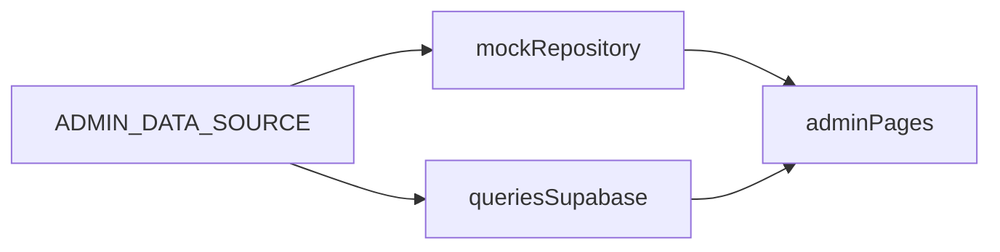

# Admin portal upgrade

Single checklist for **design acceptance** (mock-first) and **production readiness** (CRM completeness) for the local-plumbing admin experience. This document **extends** [adminUI-implementationplan.md](./adminUI-implementationplan.md); it does not replace the original scope—it adds mock-first design lock, niche analytics, and operational gaps.

---

## 1. Purpose

| Goal | Notes |
|------|--------|
| **Design acceptance** | Stakeholders can review UI/UX with predictable, demo-rich data before touching production. |
| **Production readiness** | Bookings, clients, insights, and settings behave as a coherent CRM for dispatch and ownership. |
| **Niche fit** | KPIs and workflows reflect emergency vs scheduled work, SLA-style backlogs, and plumbing-specific service mix—not generic “conversion %” only. |

---

## 2. Mock vs live

| Item | Checklist |
|------|-----------|
| **Env switch** | One flag (e.g. `ADMIN_DATA_SOURCE=mock` or `NEXT_PUBLIC_ADMIN_MOCK=1`) selects data source. |
| **Single mock layer** | `lib/admin/mock-repository.ts` (or `components/admin/mockData.ts` + thin adapters) returns the **same shapes** as live queries (`AdminDashboardMetrics`, `AdminBookingRow`, `CatalogServiceRow`, etc. in `lib/admin/queries.ts`). |
| **Query integration** | Either branch at the top of each exported function in `lib/admin/queries.ts`, or expose a `getAdminData()` facade used by pages (preferred for tests). |
| **Demo richness** | Mock includes: mixed emergency vs residential; `no_show`; empty states; long addresses; multi-day schedule; funnel events with varied `source_path`; enough rows to stress tables (scroll, pagination story). |
| **Security note** | Mock is **design-only**—no production PII; document that clearly for the team. |

---

## 3. UI checklist

### Shell and navigation

- [ ] **Dynamic title/description** in `components/admin/AdminShell.tsx` (per route or derived from `pathname`)—not static “Operations Dashboard” on every page.
- [ ] **Mobile**: collapsible sidebar or bottom nav; tables do not overflow without horizontal scroll hints where needed.
- [ ] **Alerts**: remove stub, or wire a minimal notifications panel (even mock: e.g. “2 pending confirmations older than 4h”).

### Density and readability

- [ ] **Empty states** (illustration + one CTA) on dashboard, bookings, insights when counts are zero.
- [ ] **Status colors** consistent: dashboard cards, bookings table, detail page—shared `statusVariant` mapping including **`no_show`**.
- [ ] **Loading / suspense** (optional): `loading.tsx` boundaries for admin routes.

### Bookings UX

- [ ] **Default tab**: reconsider `pending`-only default (`app/admin/bookings` searchParams)—evaluate **“All”** or **“Today”** for dispatch.
- [ ] **Search**: client name, phone, address fragment.
- [ ] **Date range** filters for CRM scale.
- [ ] **Pagination** or virtualized list when `getAdminBookings()` grows beyond current `.limit(200)`.

---

## 4. Page inventory

### Built (baseline)

| Route | Purpose |
|-------|---------|
| `/admin/dashboard` | Metrics + operations overview |
| `/admin/bookings` | List + filters |
| `/admin/bookings/[id]` | Booking detail |
| `/admin/services` | Catalog |
| `/admin/service-categories` | Categories |
| `/admin/clients` | Client list / snapshots |
| `/admin/insights` | Funnel / analytics |

Shell + nav: `components/admin/AdminShell.tsx`. Server data: `lib/admin/queries.ts`. **`components/admin/mockData.ts` is not wired** until Phase A is done.

### Gaps to close (acceptance)

| Gap | Action |
|-----|--------|
| **Bookings `no_show`** | Schema supports it; UI tabs and `updateBookingStatus` / `allowedStatuses` in `app/admin/bookings/actions.ts` must include it (see Phase E). |
| **Clients row actions** | “Profile” / “History” are placeholders—wire to real routes or remove until implemented. |
| **Alerts** | Stub in shell header—real or removed per §3. |

### Planned (Phase C+)

| Item | Suggestion |
|------|------------|
| **Client detail** | `/admin/clients/[key]` or phone hash: full history, notes, VIP/problem tag (mock first). |
| **Dispatch / day board** | **“Today”** view: sort by time window + Google Maps link from address (no map SDK required initially). |
| **Quotes / estimates** | Optional; skip if bookings-only, else minimal pipeline later. |
| **Staff / settings** | `/admin/settings`: business hours, service-area ZIP list, after-hours copy. |
| **Audit / activity** | Filterable **Activity** from `booking_events` (see `app/admin/bookings/actions.ts`) or embed on dashboard. |

### Out of scope (unchanged from original plan unless product changes)

- Public customer account portal.
- Full external BI stack.
- Marketing automation flows.

---

## 5. Niche analytics catalog (Phase D)

Definitions should align with data you can collect (`booking_funnel_events`, bookings, categories, `service_types`).

| KPI / analysis | Definition / notes |
|----------------|-------------------|
| **Emergency vs scheduled** | Split KPIs using category or a tag on `service_types` (e.g. `is_emergency`); mock first, SQL view later. |
| **SLA-style backlog** | Count **pending** bookings older than N hours; surface on dashboard. |
| **Service mix** | Residential vs commercial; top “problem” services (drains, water heater, leaks)—reuse `getServiceDemand` + category breakdown. |
| **Seasonal / campaign (optional)** | Tag landing pages or UTM in `source_path` if funnel events extended; week-over-week in Insights. |
| **Callback / repeat risk** | Customers with **>1 emergency** in 30 days (mock narrative acceptable for design). |
| **No-show & cancellation rate** | 7- and 30-day windows; requires consistent `no_show` and cancelled in UI + actions. |

---

## 6. Backend checklist (Phase E + cross-cutting)

- [ ] **Status parity**: `no_show` in UI tabs, status transitions, and `allowedStatuses` in `app/admin/bookings/actions.ts`; copy safe for legal/ops.
- [ ] **RLS / service role**: Admin reads stay on controlled paths; new client-write flows match existing role checks (`app/admin/layout.tsx`, middleware).
- [ ] **Exports**: CSV export of bookings (date range)—common owner request.
- [ ] **Observability**: Log failed catalog mutations; optional admin-only error boundary page.

---

## 7. Phasing

| Phase | Name | Summary |
|-------|------|---------|
| **A** | Lock design with mock data | Env flag; single mock layer matching `queries.ts` types; demo-rich fixtures; document mock vs live. |
| **B** | Visual and UX polish | Shell titles, mobile nav, alerts real or removed; empty states; status colors + `no_show`; optional loading boundaries; bookings search/date/pagination story. |
| **C** | Missing pages and workflows | Client detail, Today board, optional quotes, settings, activity log; fix dead Client buttons. |
| **D** | Plumbing-niche analytics | Emergency vs scheduled, SLA backlog, service mix, optional campaign/UTM, repeat emergency risk, no-show/cancel rates. |
| **E** | Backend and product hardening | Status parity, RLS documentation, CSV export, observability. |

**Suggested order**: A → B → C → D → E (D and E can overlap where analytics depends on status consistency).

---

## Relationship to [adminUI-implementationplan.md](./adminUI-implementationplan.md)

The implementation plan describes **original scope** (routes, core KPIs, security). **This file** is the forward-looking backlog for **mock-first design lock** and **CRM completeness** for the plumbing niche. Use both together: implementation plan for baseline delivery; **adminportal-upgrade.md** for acceptance criteria and phased enhancements.
