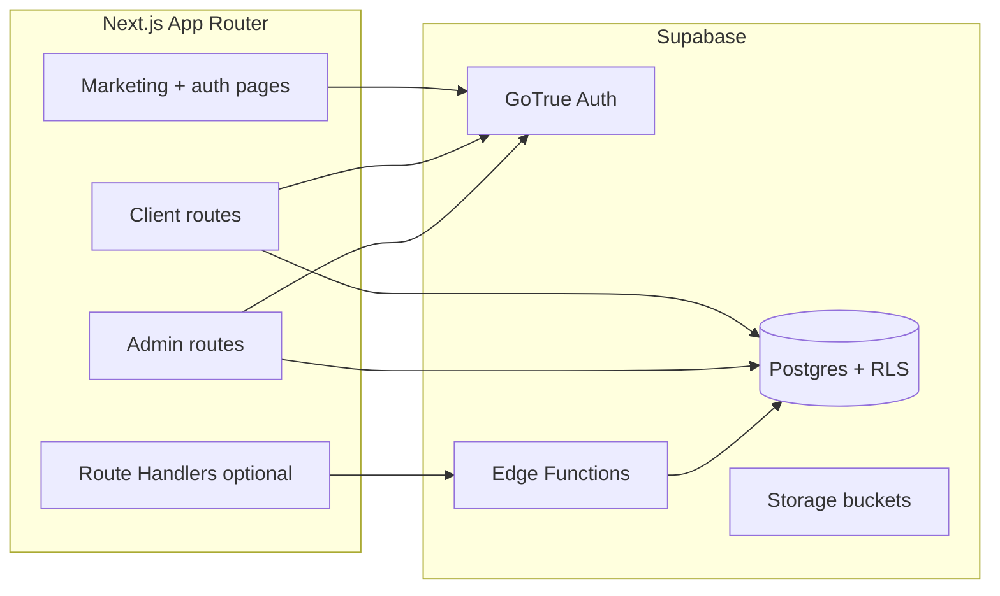

# Backend + dashboards implementation plan

## 1. Align product language with the actual business

The codebase is a **New Orleans plumbing service** site (`[app/page.tsx](app/page.tsx)`, `[components/Hero.tsx](components/Hero.tsx)`): licensed plumber, emergencies, service areas, **service appointments**—not coaching calls or abstract “sessions.”


| Your spec term         | Recommended domain term                  | Notes                                                                                                                                                   |
| ---------------------- | ---------------------------------------- | ------------------------------------------------------------------------------------------------------------------------------------------------------- |
| Session type           | **Service type** (or “booking offering”) | Maps to `serviceType` in `[components/BookingModal.tsx](components/BookingModal.tsx)`; examples: emergency visit, drain cleaning, water heater service. |
| Session (bookable)     | **Time slot** (occurrence)               | Concrete window with `starts_at` / `ends_at`, capacity, optional location.                                                                              |
| Session (saved record) | **Booking**                              | Customer holds a slot; lifecycle includes completed/cancelled.                                                                                          |
| “Book a call”          | **Book a visit / schedule service**      | Copy and routes should say plumbing-appropriate language.                                                                                               |


**Defect to fix in UX copy**: anywhere dashboards or emails say “session” or “call,” standardize on **appointment**, **service visit**, or **booking**.

**Your decisions (locked in)**:

- **Booking model**: Customers **pick a real available slot** (capacity-aware), not only a free-text preference.
- **Role `client`**: Assigned **only when a booking is marked `completed`** (job finished). Users with signups or pending bookings remain `**user**` until then—stricter than “first booking submitted,” and consistent with your answer.

---

## 2. Target architecture




- **Framework**: Keep Next.js 16 App Router; add `[@supabase/supabase-js](https://supabase.com/docs/reference/javascript/introduction)` and `[@supabase/ssr](https://supabase.com/docs/guides/auth/server-side/nextjs)` for cookie-based sessions.
- **Authorization**: **Postgres RLS** as the source of truth; use the **service role** only in Edge Functions or tightly scoped server code—never in the browser.
- **Payments**: Out of scope; store **display pricing** only (e.g. estimate range or base fee on service type). Optional `payment_status` column reserved as `not_applicable` / `offline` for future Stripe.

---

## 3. Branding guide (new pages stay on-brand)

Derived from `[app/globals.css](app/globals.css)` and the hero treatment in `[components/Hero.tsx](components/Hero.tsx)`:

- **Colors**: Primary / brand surfaces = **patriot navy** (`--patriot-blue` / `bg-brand`); CTAs and emphasis = **liberty red** (`--liberty-red` / `secondary`). Page shell stays **light gray** (`--background`); cards **white** with subtle borders (`border-border`, `bg-card`).
- **Typography**: Continue **Geist** (`--font-sans`); hierarchy: bold navy headlines on marketing; dashboard pages use `text-foreground` on `bg-background` with `text-muted-foreground` for secondary text.
- **Shape**: Radius token `--radius` (0.625rem); use existing `rounded-lg` / `rounded-xl` patterns from landing components.
- **Components**: **shadcn/ui** patterns already in `[components/ui/](components/ui)*` — for dashboards, add only what you need (e.g. `Table`, `Sheet`, `Calendar` if not present, `DataTable` pattern from shadcn docs). Prefer **lucide-react** icons (already used site-wide).
- **Marketing vs app shell**: Landing uses full-width gradient hero; **authenticated areas** should use a **compact shell**: top bar or sidebar + `container` / max-width content, same tokens—avoid reusing the full hero gradient on every admin page (use `bg-brand` strips or badges sparingly for brand continuity).

Document this short guide inside the implementation doc you will add as `[Implementation_plan.md](Implementation_plan.md)` (or keep in sync with your existing `Implementation_websitebuild_plan.md` if you prefer a single source—your call when you execute).

---

## 4. Information architecture: routes and UI patterns

**Preference**: **Dedicated routes (slugs)** for user-specific flows; **dialogs/sheets** for confirmations and small edits.

### 4.1 Public / auth


| Route                                   | Purpose                                                         |
| --------------------------------------- | --------------------------------------------------------------- |
| `/login`, `/signup`, `/logout` (action) | Supabase email/password (and optional magic link later).        |
| `/forgot-password`, `/update-password`  | Recovery flows.                                                 |
| `/book`                                 | Slot picker + service selection (evolves from modal-only flow). |


### 4.2 Client (`user` and `client`)


| Route                           | Purpose                                                                                                                                                                                                      |
| ------------------------------- | ------------------------------------------------------------------------------------------------------------------------------------------------------------------------------------------------------------ |
| `/account`                      | Dashboard summary: upcoming booking, quick actions.                                                                                                                                                          |
| `/account/profile`              | Name, phone, email, addresses; photo optional (Storage).                                                                                                                                                     |
| `/account/bookings`             | List with filters (upcoming / past / cancelled).                                                                                                                                                             |
| `/account/bookings/[bookingId]` | **Slug page** for one booking: status timeline, service type, slot time, service address, cancel request (modal confirms). Use **opaque UUID** in URL; optional short **public reference code** for support. |


**Suggested extra client pages**

- `/account/notifications` (phase 2): email/SMS prefs—stub if not implemented.
- `/account/help` or link-out to contact—reduces support load.

### 4.3 Admin (role-gated)


| Route                         | Purpose                                                                                                                                 |
| ----------------------------- | --------------------------------------------------------------------------------------------------------------------------------------- |
| `/admin`                      | Redirect to `/admin/dashboard`.                                                                                                         |
| `/admin/dashboard`            | KPIs: bookings today, completion rate, capacity usage (use existing **recharts** from `[package.json](package.json)`).                  |
| `/admin/calendar`             | Week/month view of slots + bookings (read-heavy).                                                                                       |
| `/admin/service-types`        | CRUD **service types** (list + `/admin/service-types/[id]` for edit).                                                                   |
| `/admin/availability`         | Rules: recurring windows, blackouts, date ranges, “ongoing” vs bounded campaigns.                                                       |
| `/admin/slots` (optional)     | Debug / override generated slots if you pre-materialize rows.                                                                           |
| `/admin/bookings`             | Pipeline: confirmed, in progress, completed, cancelled.                                                                                 |
| `/admin/bookings/[bookingId]` | Full detail, internal notes, status changes, cancellation reason entry.                                                                 |
| `/admin/clients`              | Users who have **completed** bookings (and optionally all accounts with filters).                                                       |
| `/admin/users`                | **User management**: roles, ban/reject, view login activity summary.                                                                    |
| `/admin/sessions`             | **Rename conceptually** to **“Auth sessions”** or fold into `/admin/users/[id]`—Supabase **session revocation** via Admin API (see §8). |
| `/admin/reporting`            | Exports / date-range reports (bookings, completions, cancellations).                                                                    |
| `/admin/settings`             | Business profile, default service area text, notification emails, feature flags.                                                        |


**Modals / sheets (not full pages)**

- Cancel booking confirmation + reason.
- Quick edit: phone, internal note snippet.
- Ban user confirmation with reason.
- “Generate slots for range” confirmation.

### 4.4 Layout and protection

- `**middleware.ts`**: Refresh Supabase session; redirect unauthenticated users from `/account/*` and `/admin/*`.
- **Server layouts**: `app/(client)/layout.tsx` and `app/(admin)/layout.tsx` with shared nav; fetch `profiles.role` and `profiles.status` server-side for gating.
- **Admin gate**: Only `role = admin` (and optionally `staff` with a permissions matrix later).

---

## 5. Database schema (Postgres)

### 5.1 Core identity and roles

`**profiles`** (1:1 with `auth.users`)

- `id` (uuid, PK, = `auth.users.id`)
- `full_name`, `phone`, `avatar_url`
- `role`: `enum` — `user` | `client` | `admin` | `staff` (optional fourth for field ops without full admin)
- `status`: `active` | `banned` | `suspended` (or `rejected` if you approve signups—only if needed)
- `banned_at`, `ban_reason` (nullable)
- `promoted_to_client_at` (nullable; set when first booking → `completed`)
- `created_at`, `updated_at`

**Role rules**

- New signup: `role = user`, `status = active`.
- **No auto-`client` on booking**; on first transition of any booking to `**completed`**, set `role = client` and set `promoted_to_client_at`.
- Admin can **ban**: `status = banned`; RLS denies all writes/reads as appropriate; optional Edge Function to **revoke refresh tokens** (see §8).

### 5.2 Service catalog

`**service_types`**

- `id`, `slug` (unique), `title`, `description`
- `duration_minutes` (for slot length)
- `base_price_display` (text, e.g. “From $X” — no Stripe yet) or `base_price_cents` nullable
- `buffer_minutes` (travel/prep between jobs)
- `max_bookings_per_slot` default 1 (or capacity per slot instance)
- `default_location_id` nullable
- `is_active`, `sort_order`
- `metadata` jsonb (e.g. maps to marketing “segment” keys from `[data/serviceSegments](data/serviceSegments)` later)

`**locations**` (dispatch / office / zones)

- `id`, `name`, `address`, `timezone` (default `America/Chicago` or correct for NOLA)
- `is_active`

### 5.3 Availability and slots (slot-based booking)

`**availability_rules**`

- `id`, `service_type_id` (nullable = applies to multiple or all with scoping logic you define)
- `location_id` nullable
- `rule_kind`: `recurring` | `date_range` | `blackout`
- For recurring: `days_of_week` (int[] or bitfield), `start_local_time`, `end_local_time`
- For ranges: `valid_from`, `valid_to` nullable (**ongoing** = `valid_to` null + flag `is_indefinite`)
- `priority` (resolve overlaps: higher wins)
- `is_active`

**Slot storage strategy** (pick one in implementation; recommend **hybrid**)

1. **Generated on read**: Edge Function or SQL function expands rules into slots for a date range (heavier CPU, flexible).
2. **Materialized `slots` table**: nightly or admin-triggered generation; columns: `id`, `service_type_id`, `location_id`, `starts_at`, `ends_at`, `capacity`, `booked_count` (maintained by trigger), `is_published`.
3. **Hybrid**: generate for next N weeks; archive old rows.

`**slots**`

- `id`, `service_type_id`, `location_id`
- `starts_at`, `ends_at` (timestamptz)
- `capacity` int, `booked_count` int (check `booked_count <= capacity`)
- `status`: `open` | `closed` | `full`
- Indexes on `(starts_at, service_type_id)` for picker queries

`**bookings**`

- `id`, `user_id` → profiles
- `slot_id` → slots
- `service_type_id` (denormalized for history if slot deleted—snapshot below)
- `service_address`, `address_line2`, `city`, `state`, `postal_code` (snapshot at booking time)
- `customer_notes`, `internal_notes` (admin only via RLS)
- `status`: `pending` (optional hold) | `confirmed` | `in_progress` | `completed` | `cancelled` | `no_show`
- `cancelled_at`, `cancelled_by` (`user` | `admin` | `system`), `cancellation_reason`
- `completed_at`
- `created_at`, `updated_at`
- **Concurrency**: booking insert must **atomically** increment slot usage or use `SELECT … FOR UPDATE` in a transaction / RPC to prevent oversubscription.

`**booking_events**` (audit trail)

- `id`, `booking_id`, `actor_user_id` nullable, `event_type` (created, status_changed, note_added, cancelled, …), `payload` jsonb, `created_at`

### 5.4 History and compliance-style logging


| Table / mechanism                   | Purpose                                                                                                                                                                                                                                                                                                                                                    |
| ----------------------------------- | ---------------------------------------------------------------------------------------------------------------------------------------------------------------------------------------------------------------------------------------------------------------------------------------------------------------------------------------------------------- |
| `**login_events**`                  | Append-only: `user_id`, `occurred_at`, `ip`, `user_agent`, `auth_provider`. Populate from a **server Route Handler** or **Edge Function** called once after successful login/session establishment (Supabase does not expose every login to Postgres on all tiers without [Auth Hooks](https://supabase.com/docs/guides/auth/auth-hooks) where available). |
| `**booking_events**`                | Full booking lifecycle history (required for admin reporting and disputes).                                                                                                                                                                                                                                                                                |
| `**admin_audit_log**`               | Ban, unban, role change, settings change: `admin_id`, `target_user_id`, `action`, `details` jsonb, `created_at`.                                                                                                                                                                                                                                           |
| `**profile_change_log**` (optional) | If you need strict PII audit; else fold into `admin_audit_log`.                                                                                                                                                                                                                                                                                            |


**Suggested extras**

- `**notification_queue**` (phase 2): outbound email/SMS jobs.
- `**saved_addresses**` (optional): repeat customers—`user_id`, label, full address fields.

### 5.5 Storage buckets

- `**avatars**`: public read, authenticated write own folder `user_id/*`.
- `**job-photos**` (future): private, signed URLs; RLS via metadata—can be empty until field workflow exists.

---

## 6. Row Level Security (RLS) outline

- `**profiles**`: user reads/updates own row; admin reads all; ban blocks self-service updates except maybe “contact support.”
- `**bookings**`: user sees own; admin/staff sees all; inserts allowed for authenticated users subject to slot availability RPC.
- `**slots**`, `**service_types**`, `**locations**`: public **read** for `is_active` / published slots only; writes **admin only**.
- `**availability_rules**`: admin only.
- `**admin_audit_log``, **`login_events`**: admin read; inserts via service role or restricted policies (e.g. insert only for` auth.uid()` on own login_events).

Use **SECURITY DEFINER** Postgres functions for: `create_booking_for_slot`, `admin_set_booking_status`, `increment_slot_booked_count` with checks.

---

## 7. Supabase Edge Functions (when to use)


| Function                       | Role                                                                         |
| ------------------------------ | ---------------------------------------------------------------------------- |
| `book-slot`                    | Validates slot open, creates booking in one transaction; returns booking id. |
| `generate-slots`               | Admin/cron: expand rules into `slots` rows.                                  |
| `on-booking-completed`         | Sets `profiles.role` to `client` on first completion (idempotent).           |
| `admin-revoke-sessions`        | Calls Supabase Admin API to sign out user everywhere after ban.              |
| Optional: `send-booking-email` | If you want email outside Next.js (Resend/SendGrid).                         |


Keep **Zod validation** inside functions; mirror critical rules on the client for UX only.

---

## 8. Admin “session management”

- **Product meaning**: List active sessions / **force logout** / revoke refresh tokens for a `user_id` using **Supabase Admin API** (`auth.admin.signOut` or invalidate user sessions per Supabase docs for your version).
- **UI**: Under `/admin/users/[id]` show “Sessions” with **Revoke all sessions** + confirmation modal; log action in `admin_audit_log`.

---

## 9. Integration with existing site

- Today: `[components/BookingModal.tsx](components/BookingModal.tsx)` posts to `[app/api/booking/route.ts](app/api/booking/route.ts)` which only logs.
- **Phase approach**
  1. Add Supabase + auth pages; **no change** to modal yet.
  2. Replace modal submit path: either open `**/book`** with query params (`?service=drain`) or keep modal as **shortcut** that redirects to `/book` after auth if required.
  3. Implement slot picker on `/book` (uses `service_types` + available `slots`).
  4. Deprecate pure “preferred time only” flow or keep as fallback **waitlist** row (optional `bookings` without `slot_id`)—your choice; slot-based is primary per your answer.

---

## 10. Reporting (admin)

- Bookings by status over time, cancellation reasons (aggregate), utilization by `service_type` and `location`, peak hours.
- Export CSV via server route or Edge Function (service role) with date filters.

---

## 11. Security and operations

- Environment: `NEXT_PUBLIC_SUPABASE_URL`, `NEXT_PUBLIC_SUPABASE_ANON_KEY`, `SUPABASE_SERVICE_ROLE_KEY` (server/Edge only).
- **CORS** and **allowed redirect URLs** configured in Supabase dashboard for production domain.
- Rate limiting: consider **Upstash** or Vercel middleware for `/signup`, `/book`, login (execution phase).
- Backups: Supabase project backups on; document restore drill.

### 11.1 Environment variables (copy/paste template)

Add these to your local `.env` (and the matching values in your deployment provider):

```bash
# Supabase project URL (public)
NEXT_PUBLIC_SUPABASE_URL=https://YOUR_PROJECT_REF.supabase.co

# Supabase anon key (public, safe for browser usage with RLS)
NEXT_PUBLIC_SUPABASE_ANON_KEY=YOUR_SUPABASE_ANON_KEY

# Supabase service role key (server/Edge only, never expose to client)
SUPABASE_SERVICE_ROLE_KEY=YOUR_SUPABASE_SERVICE_ROLE_KEY
```

Rules:

- `NEXT_PUBLIC_*` variables are exposed to browser bundles by Next.js.
- Keep `SUPABASE_SERVICE_ROLE_KEY` in server-only contexts (Route Handlers, server actions, Edge Functions, or Supabase platform secrets).
- Never commit real keys to git; store secrets in your hosting environment manager.

---

## 12. Implementation phases (step-by-step)

**Execution order:** The repo root [`Implementation_plan.md`](../Implementation_plan.md) defines the **phased rollout** in use: (1) Supabase + **full** schema, (2) signup/login, (3) **manual** admin bootstrap and roles, (4) **mock** customer and admin dashboards to test auth, then (5+) full booking and operations. Use the numbered checklist below as the full technical backlog; sequence sprints to match `Implementation_plan.md` when the two differ.

1. **Supabase project**: Create project, enable Auth (email/password), configure URL redirects, local env vars.
2. **Schema migration**: Tables above + enums + indexes + RLS policies + core RPCs (`create_booking`, `set_booking_status`).
3. **Next.js Supabase helpers**: `middleware.ts`, `lib/supabase/server.ts` + `client.ts`, cookie handling per official Next.js guide.
4. **Auth UI**: `/login`, `/signup`, `/forgot-password` using shadcn forms; toast errors (sonner already in use).
5. `**profiles` sync**: Trigger on `auth.users` insert to create profile with `role = user`.
6. **Admin bootstrap**: Script or one-time SQL to set first admin by email.
7. **Service types + locations admin UI**: CRUD pages.
8. **Availability rules UI + slot generation**: Edge Function or SQL + admin “generate” button.
9. **Public `/book` flow**: Service → date → slot → address/notes → RPC `book-slot`.
10. **Client `/account/*`**: List/detail bookings; cancel with reason (modal).
11. **Status workflow**: Admin moves `confirmed` → `in_progress` → `completed`; trigger promotes to `client`.
12. **Admin dashboards**: Calendar, bookings pipeline, users, audit logs, login_events ingestion.
13. **Login history**: Implement post-auth logging path; verify rows in staging.
14. **Storage**: Avatars bucket + RLS.
15. **Hardening pass**: RLS penetration tests, banned user behavior, oversubscription tests.
16. **Future hook**: Stripe fields and `payment_intent_id` placeholder—document only.

---

## 13. Optional improvements (not required day one)

- **Staff role** with scoped permissions (view bookings, no user ban).
- **Waitlist** when no slots: capture intent without a slot.
- **SMS** reminders (Twilio) via Edge Function + queue.
- **Google Calendar** sync for dispatch (one-way export).

---

## 14. Deliverable file

When you exit plan-only mode, add `**[Implementation_plan.md](Implementation_plan.md)`** at the repo root containing this plan (you can paste the approved plan content and expand any section with SQL sketches or wireframe notes). No application code until that file is reviewed and locked.