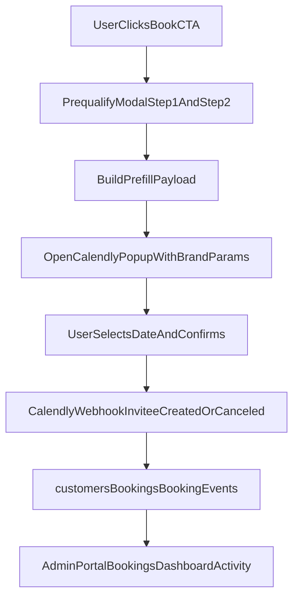

# Booking Modal + Calendly Flow Updates Plan

## Goal

Refine the new pre-booking + Calendly popup pathway so it is cleaner, brand-consistent, and avoids duplicate user entry:

1. Replace ZIP-only question with full address question (ZIP inferred from address).
2. Ensure details entered in pre-questions flow into Calendly so users are not retyping.
3. Apply site colorway across pre-question modal and Calendly popup params.
4. Fix modal/popup sizing so content and close button are fully visible on desktop and mobile.

---

## Current baseline in repo

- Pre-question modal exists: `components/calendly/CalendlyPrequalifyModal.tsx`.
- Popup orchestration exists: `components/SiteChrome.tsx`.
- Calendly URL branding params exist: `lib/calendly.ts`.
- Current prefill only passes `name` + `email`.
- Current step-1 question #3 asks ZIP code (`zipCode`) directly.

---

## Scope decisions

### In scope

- Update pre-question fields and UX.
- Expand data handoff to Calendly using supported prefill/custom answer params.
- Improve visual design and sizing behavior for the full booking pathway.

### Out of scope

- Calendly Scheduling API.
- New admin UI in site for Calendly event/question management.
- Replacing Calendly embed with custom booking engine.

---

## Implementation approach

## 1) Replace ZIP question with address-first capture

### Changes

- In `components/calendly/CalendlyPrequalifyModal.tsx`:
  - Remove `zipCode` from `QualifyData`.
  - Add `address` field.
  - Replace question label from ZIP to:
    - `What is the service address?`
  - Optional: reuse `AddressAutocompleteInput` for better consistency with booking modal UX.

### Validation

- Require non-empty address (min length rule).
- Keep `canGoNext` based on service type, urgency, address, customer type, timeframe.

### Notes

- ZIP is inferred by Calendly location parsing or downstream operations; no separate ZIP prompt required in pre-step.

---

## 2) Avoid retyping in Calendly by passing collected data

Calendly popup supports standard `prefill` (name/email) and optional custom answers depending on configured invitee questions.

### Changes

- Extend `CalendlyPrefill` in `lib/calendly.ts` to support optional structure for custom answers:
  - `name`, `email`
  - `customAnswers` object for mapped question values (service type, urgency, address, customer type, timeframe, notes).

- Update `components/calendly/CalendlyPrequalifyModal.tsx`:
  - Keep step 1 + step 2.
  - On continue, pass all collected fields via `onContinue(prefillPayload)`.

- Update `components/SiteChrome.tsx`:
  - Accept richer prefill payload and pass it to `openCalendlyPopup(...)`.

- Ensure Calendly event type in Calendly dashboard has matching invitee questions so values land correctly.

### Mapping strategy

- Map each pre-question to the corresponding Calendly invitee question key.
- If a key is missing or mismatched, degrade gracefully:
  - still pass name/email
  - keep other values for optional local logging (future enhancement).

---

## 3) Apply brand colorway from pre-questions through Calendly popup

## A. Pre-question modal branding (`components/calendly/CalendlyPrequalifyModal.tsx`)

- Replace neutral shell with site theme styling:
  - header gradient using `from-primary to-primary/90`
  - stronger CTA with `bg-secondary text-secondary-foreground`
  - card/background + border aligned with existing modal design language
  - typography and spacing aligned to `BookingModal`.

- Add clear section hierarchy and concise helper text for non-dull presentation.

## B. Calendly popup branding (`lib/calendly.ts` + env)

- Keep / verify:
  - `primary_color`
  - `text_color`
  - `background_color`
  - `hide_gdpr_banner` as policy-defined
- Ensure env values are aligned with current site tokens:
  - primary `0b3a62`
  - text `0f172a`
  - background `eef2f8`

### Limitation reminder

- Calendly internal widget styling is limited to supported params; full CSS takeover is not possible.

---

## 4) Fix sizing and close-button visibility

## A. Pre-question modal sizing (`components/calendly/CalendlyPrequalifyModal.tsx`)

- Set modal container behavior similar to existing booking modal:
  - `max-h-[90vh]`
  - `overflow-y-auto`
  - responsive `max-w` (`max-w-2xl` desktop, full width mobile)
- Keep top/header area sticky when scrolling long content.
- Ensure close button has minimum hit area (`min-h-[44px] min-w-[44px]`) and high contrast.

## B. Calendly popup visibility constraints

- Ensure triggering context does not clip overlays:
  - avoid parent transforms/overflow constraints that can affect popup rendering.
- Validate on mobile viewport heights and iOS Safari where popups often feel oversized.

---

## Data flow after updates

---

## File-level plan

- Update: `components/calendly/CalendlyPrequalifyModal.tsx`
  - replace ZIP with address
  - improve visuals, sizing, close button behavior
  - pass richer payload on continue

- Update: `components/SiteChrome.tsx`
  - accept richer prefill payload and forward to popup opener

- Update: `lib/calendly.ts`
  - extend prefill typing for custom answer mapping

- Optional update: `lib/calendly-script.ts`
  - widen prefill type handling if needed for stronger typing

- Optional update: `README.md`
  - add short note on required Calendly invitee question mapping for zero-retype flow

---

## QA checklist

- Address question appears instead of ZIP question.
- User can proceed only when address is entered.
- Calendly opens with prefilled name/email and mapped custom answers when configured.
- User is not asked to retype the same info unnecessarily.
- Visual style matches site colorway across question steps.
- Modal/popup fit within viewport; close button always visible/clickable.
- Desktop + mobile checks:
  - Chrome, Safari
  - iOS Safari viewport behavior
- Fallback behavior still works if Calendly popup cannot open.

---

## Rollout sequence

1. Ship UI + data mapping updates behind existing popup flow flag.
2. Verify Calendly invitee question mapping in a test event type.
3. Run staging manual test (full journey + cancellation webhook).
4. Promote to production and monitor booking completion/drop-off.

---

## Risks and mitigations

- **Risk:** Calendly question keys mismatch -> values not prefilled.
  - **Mitigation:** Document exact question mapping and verify with a test booking.

- **Risk:** mobile viewport clipping hides controls.
  - **Mitigation:** use capped modal height + scrollable body + sticky header/close.

- **Risk:** visual mismatch remains due to Calendly limits.
  - **Mitigation:** maximize supported color params and style all surrounding shell consistently.
